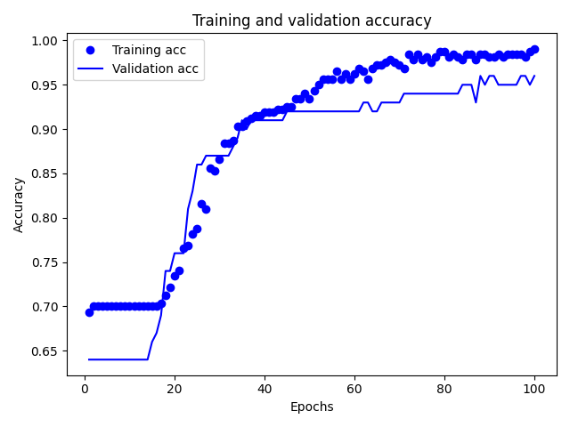
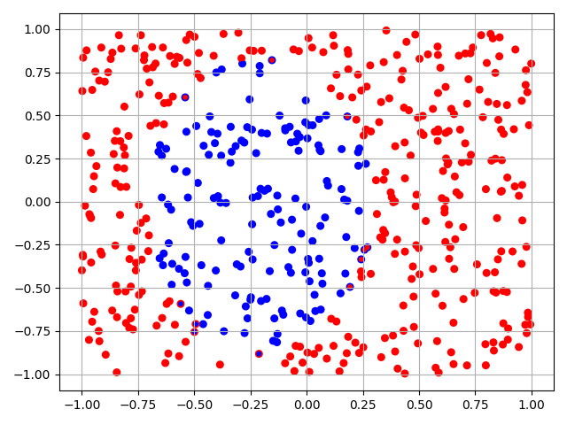
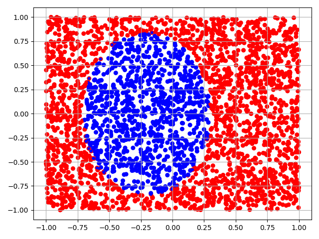

# Мирончик Павел, 8382, вар.3

Функция `genData` генерирует данные для обучения и проверки, суммарное количество которых равняется по умолчанию 500 и передается в параметре. Данные представляют собой пары чисел от -1 до 1. 

После генерации данных создается модель

```model = models.Sequential()```

которая заполняется полносвязными слоями: 

```
model.add(layers.Dense(45, activation="relu"))
model.add(layers.Dense(45, activation="relu"))
model.add(layers.Dense(1, activation='sigmoid'))
```

При компиляции модели указывается функция оптимизации `rmsprop` и функция потерь `binary_crossentropy`, используемая при бинарной классификации:

```model.compile(optimizer='rmsprop', loss='binary_crossentropy', metrics=['accuracy'])```

После создания модели производится обучение, результаты которого заносятся в переменную `H`. Обучение производится на 80% от общего числа данных `train_data`.

```
part_train_size = round(len(train_data) * 0.8)
part_train_x = train_data[:part_train_size, :]
part_train_y = train_label[:part_train_size, :]
...
H = model.fit(part_train_x, part_train_y, epochs=100, batch_size=50, validation_data=(test_data, test_label))
```

Для отображения результатов обучения строятся графики ошибки и точности. 



  
Также построен график оценки модели на проверочных данных:

```
results = model.evaluate(test_data, test_label)
print(results)
```

При помощи функции `drawResults` были отображены ожидаемые результаты и наложенные на них результаты нейросети:

```
all_data = np.vstack((train_data, test_data))
all_label = np.vstack((train_label, test_label))
pred = model.predict(all_data)
drawResults(all_data, all_label, pred)
```



Если увеличить количество генерируемых даннных до 3000 то можно увидеть более четрую картинку:

