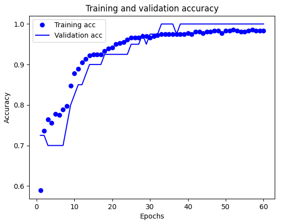
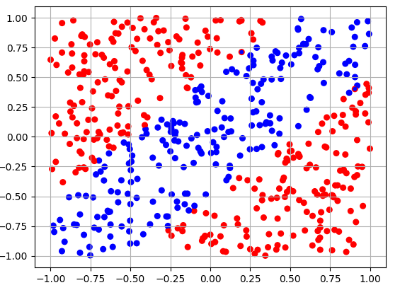

# Практика 2
## Вариант №1
Необходимо дополнить следующий фрагмент кода моделью ИНС, которая способна провести бинарную классификацию по сгенерированным данным:
```
def genData(size=500):
    data = np.random.rand(size, 2)*2 - 1
    label = np.zeros([size, 1])
    for i, p in enumerate(data):
        if (p[0] + .5 >= p[1]) and (p[0] - 0.5 <= p[1]):
            label[i] = 1.
        else:
            label[i] = 0.
    div = round(size*0.8)
    train_data = data[:div, :]
    test_data = data[div:, :]
    train_label = label[:div, :]
    test_label = label[div:, :]
	return (train_data, train_label), (test_data, test_label)
```

## Описание решения

В ходе решения задачи была выбрана данная архитектура модели по 32 нейрона в двух скрытых слоях(при уменьшении количества нейронов, модель обучалась с более низкой точностью, а при увеличении видимых изменений не происходило):
```
model = models.Sequential()
model.add(layers.Dense(32, activation="relu", input_shape=(2,)))
model.add(layers.Dense(32, activation="relu"))
model.add(layers.Dense(1, activation="sigmoid"))
```
Инициализация параметров обучения:
```
model.compile(optimizer='rmsprop', loss='binary_crossentropy', metrics=['accuracy'])
```
Обучение сети(проводится в течении 60 эпох по 20 образцов)
```
H = model.fit(train_data, train_label, epochs=60, batch_size=20, validation_split=0.1)
```

## Графики для тестового решения




## Оценка тестовой модели
Для оценки модели после ее обучения на тестовых данных, использовалась функция evaluate:
```
results = model.evaluate(test_data, test_label)
print(results)
```
Для данной модели точность составила 98%
```
[0.07120580226182938, 0.9800000190734863]
```
