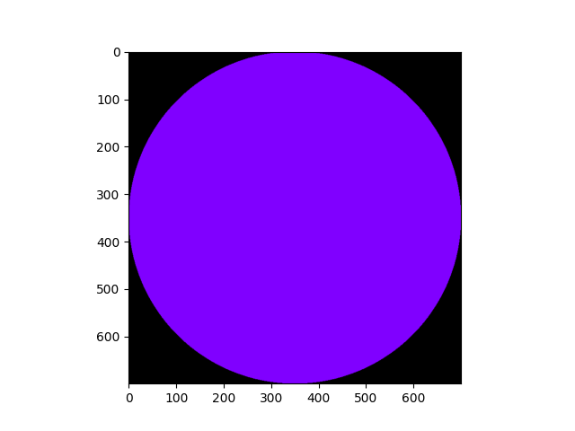

# Практика 3
## Вариант №6

Написать функцию, которая возвращает тензор представляющий изображение круга с заданным цветом и радиусом в схеме rgb на черном фоне.


## Описание решения

Входные данные включают в себя четыре числа через запятую - радиус окружности и цвет в формате rgb.
В ходе решения задачи была написана функция tensor_circle(radius, color), которая дает тензор(трехмерную матрицу). Изначально матрица заполняется нулями(черный фон), далее мы проходим по индексам тензора(нашего изображения) с помощью функции ndindex и проверяет, входит ли координата в окружность с помощью формулы __((a - x)^2 + (b - y)^2) <= r^2__ , где x и y - центр окружности(в нашем случае он равен радиусу), а r радиус. В случае совпадения, передается цвет закрашивания круга.
```
def tensor_circle(radius, color):
    tensor = np.zeros((radius*2, radius*2, 3), dtype='int')

    for ind in np.ndindex(radius*2, radius*2):
        if abs((ind[0] - radius) ** 2 + (ind[1] - radius) ** 2) <= radius ** 2:
            tensor[ind[0]][ind[1]] = color

    return tensor
```
Считывание данных из файла:
```
data_file = np.fromfile('data_circle.csv', dtype='int', sep=',')
radius = data_file[0]
color = data_file[1:4]
```
Вывод результата в png файл
```
plt.imshow(tensor)
plt.savefig('circle.png')
```

## Пример работы
Для входных данных 350,128,0,255
