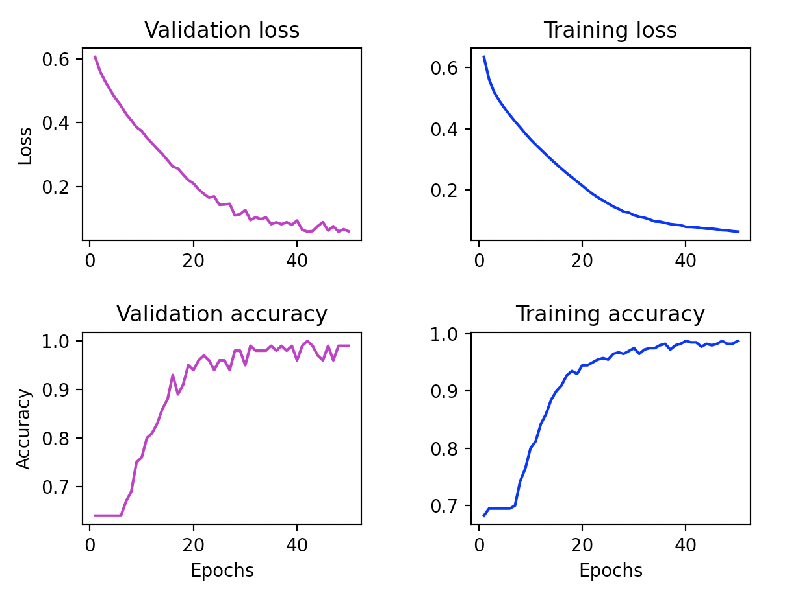
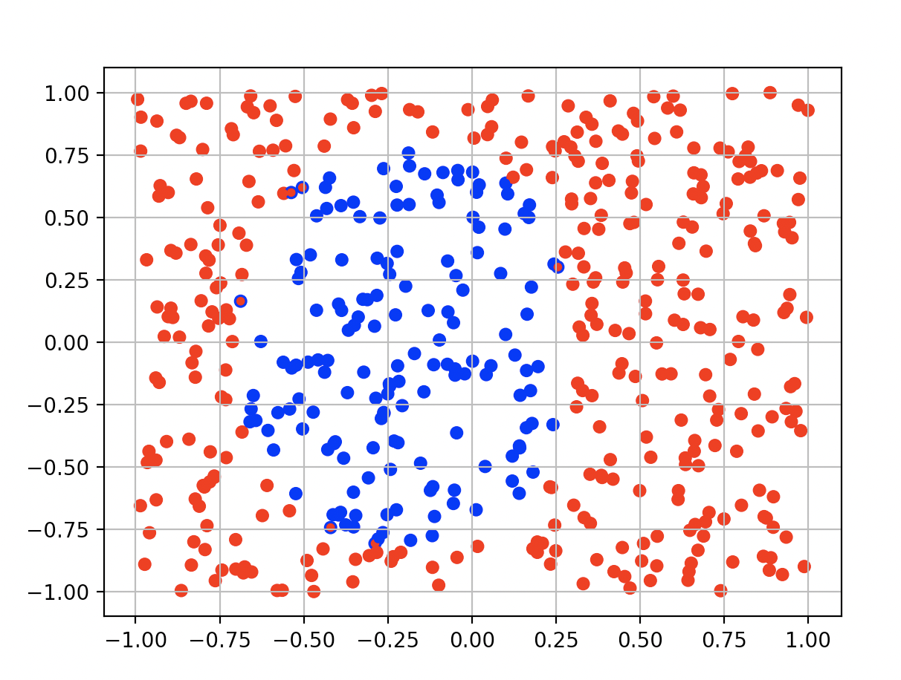

# 8383 Pereverzev Dmitriy pr2 v3

Необходимо дополнить следующий фрагмент кода моделью ИНС, которая способна провести бинарную классификацию по сгенерированным данным:

```py
import numpy as np
import matplotlib.pyplot as plt
import matplotlib.colors as mclr
from tensorflow.keras import layers
from tensorflow.keras import models

def genData(size=500):
    #Функцию выбрать в зависимости от варианта

def drawResults(data, label, prediction):
    p_label = np.array([round(x[0]) for x in prediction])
    plt.scatter(data[:, 0], data[:, 1], s=30, c=label[:, 0], cmap=mclr.ListedColormap(['red', 'blue']))
    plt.scatter(data[:, 0], data[:, 1], s=10, c=p_label, cmap=mclr.ListedColormap(['red', 'blue']))
    plt.grid()
    plt.show()

(train_data, train_label), (test_data, test_label) = genData()


#В данном месте необходимо создать модель и обучить ее


#Получение ошибки и точности в процессе обучения
loss = H.history['loss']
val_loss = H.history['val_loss']
acc = H.history['accuracy']
val_acc = H.history['val_accuracy']
epochs = range(1, len(loss) + 1)
#Построение графика ошибки
plt.plot(epochs, loss, 'bo', label='Training loss')
plt.plot(epochs, val_loss, 'b', label='Validation loss')
plt.title('Training and validation loss')
plt.xlabel('Epochs')
plt.ylabel('Loss')
plt.legend()
plt.show()

#Построение графика точности

plt.clf()
plt.plot(epochs, acc, 'bo', label='Training acc')
plt.plot(epochs, val_acc, 'b', label='Validation acc')
plt.title('Training and validation accuracy')
plt.xlabel('Epochs')
plt.ylabel('Accuracy')
plt.legend()
plt.show()

#Получение и вывод результатов на тестовом наборе

results = model.evaluate(test_data, test_label)
print(results)

#Вывод результатов бинарной классификации

all_data = np.vstack((train_data, test_data))
all_label = np.vstack((train_label, test_label))
pred = model.predict(all_data)
drawResults(all_data, all_label, pred)
```

<hr>

## НС Модель 

```py
model = Sequential()
model.add(Dense(40, activation='relu', input_shape=(2,)))
model.add(Dense(24, activation='relu'))
model.add(Dense(1, activation='sigmoid'))

model.compile(optimizer='rmsprop', loss='binary_crossentropy',
              metrics=['accuracy'])
H = model.fit(train_data, train_label, epochs=50, batch_size=10,validation_data=(test_data, test_label), verbose=2)

```

### Слои

1. Вход: `input_shape=(2,)`
2. Скрытый слой: 
    - нейронов: `40` 
    - функция активации: `relu`
3. Скрытый слой: 
    - нейронов: `24` 
    - функция активации: `relu`
3. Выход: 
    - нейронов: `1` 
    - функция активации: `sigmoid`

### Оптимизатор
Был выбран оптимизатор RMSprop (среднеквадратичное распространение)

### Функция потерь
Была выбрана функция потерь binary_crossentropy (вычисляет двоичную потерю кроссэнтропии)

### Метрика
Для метрики выбрана точность, для вычисления, как часто прогнозы совпадают с метками.

### Эпохи, батч
Было взято `50 эпох` с `размером батча 10`

### Результат
`[0.05893159285187721, 0.9900000095367432]`




Видно, что высокая `точность ~99%` достигается уже на `30 эпохе`. Итоговая точность составляет `99%`, но на некоторых эпохах она достигает и `100%`


