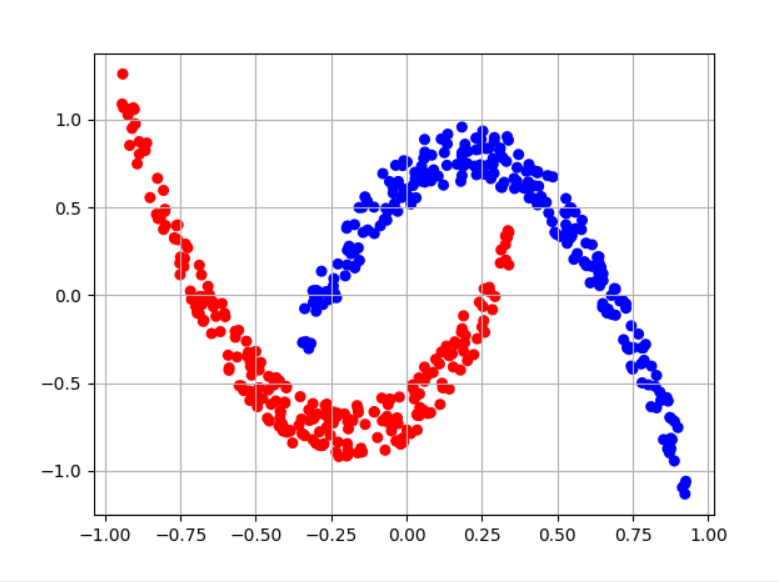
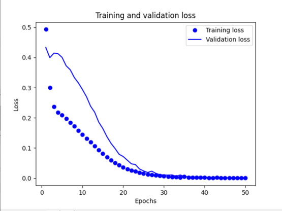
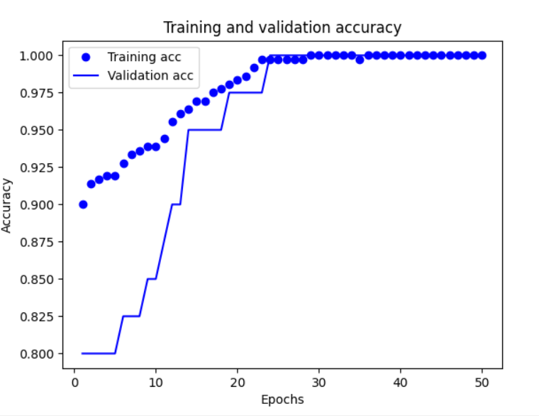
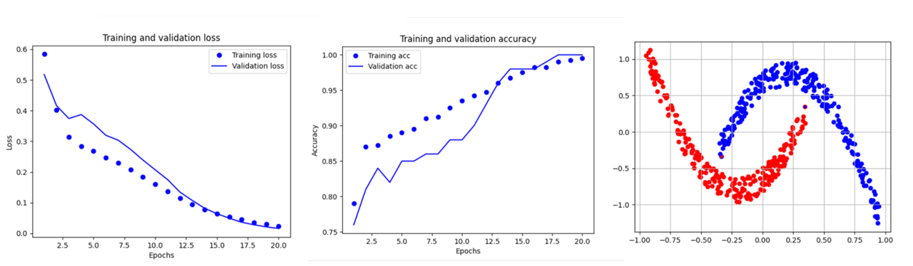
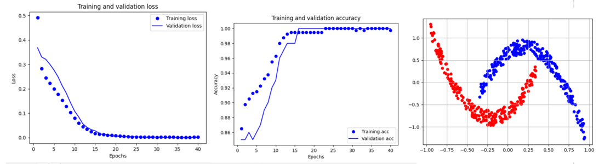

## Практическое задание №2

### Вариант №5

С поставленной задачей лучше всего справилась следующая ИНС:

```
model = models.Sequential()
model.add(layers.Dense(70, activation='relu', input_shape=(2,)))
model.add(layers.Dense(70, activation='relu'))
model.add(layers.Dense(1, activation='sigmoid'))

model.compile(optimizer='rmsprop', loss='binary_crossentropy', metrics=['accuracy'])
H = model.fit(train_data, train_label, epochs=50, batch_size=10, validation_split=0.1)
```

При выполнение лабораторной работы, отметили, что если есть возможность сокращать число скрытых слоёв, то лучше делать это.

В нашей задачи в качестве оптимизатора будет использоваться RMSProp, функцией потерь бинарная кросс-энтропия (функция, которая в основном используется при бинарной классификации), а в качестве метрики используется точность.

### Результаты работы:

[0.000644682499114424, 1.0]

Для тестовых данных точность 100%, что и подтверждает полученное изображение:



Графики потерь и точности:





### Тестирование:

Было проведено несколько тестирований для поиска наилучшей модели. Результаты представлены с краткими подписями.

- 

  Данные ИНС:

  model = models.Sequential()
   model.add(layers.Dense(40, activation='relu', input_shape=(2,)))
   model.add(layers.Dense(50, activation='relu'))
   model.add(layers.Dense(1, activation='sigmoid'))

   model.compile(optimizer='rmsprop', loss='binary_crossentropy', metrics=['accuracy'])
   H = model.fit(train_data, train_label, epochs=20, batch_size=5, validation_split=0.1)

- 

  Данные ИНС:

  model = models.Sequential()
   model.add(layers.Dense(70, activation='relu', input_shape=(2,)))
   model.add(layers.Dense(70, activation='relu'))
   model.add(layers.Dense(1, activation='sigmoid'))

   model.compile(optimizer='rmsprop', loss='binary_crossentropy', metrics=['accuracy'])
   H = model.fit(train_data, train_label, epochs=40, batch_size=5, validation_split=0.1)